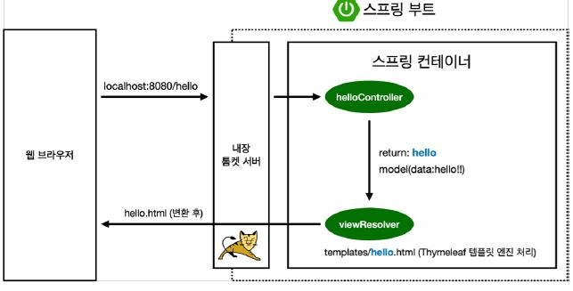
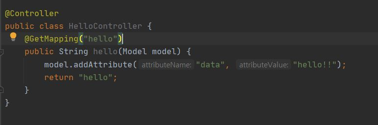
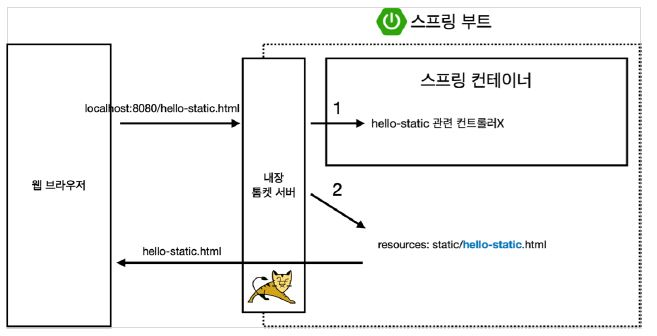
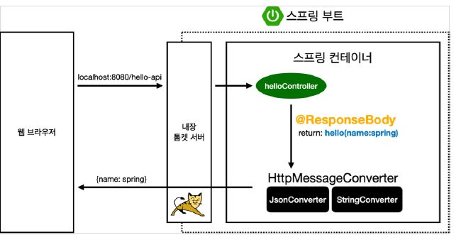
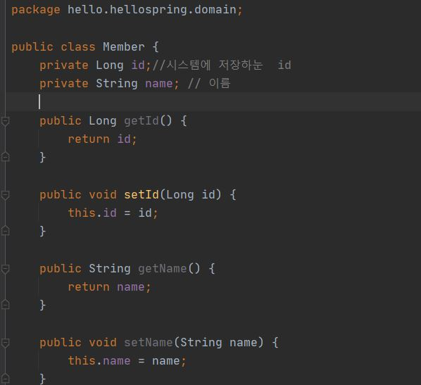
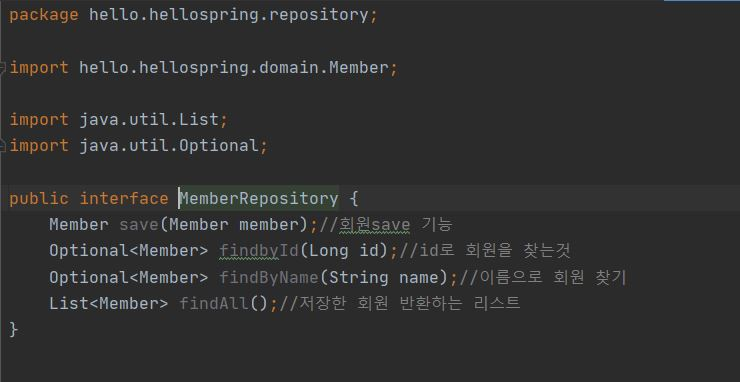
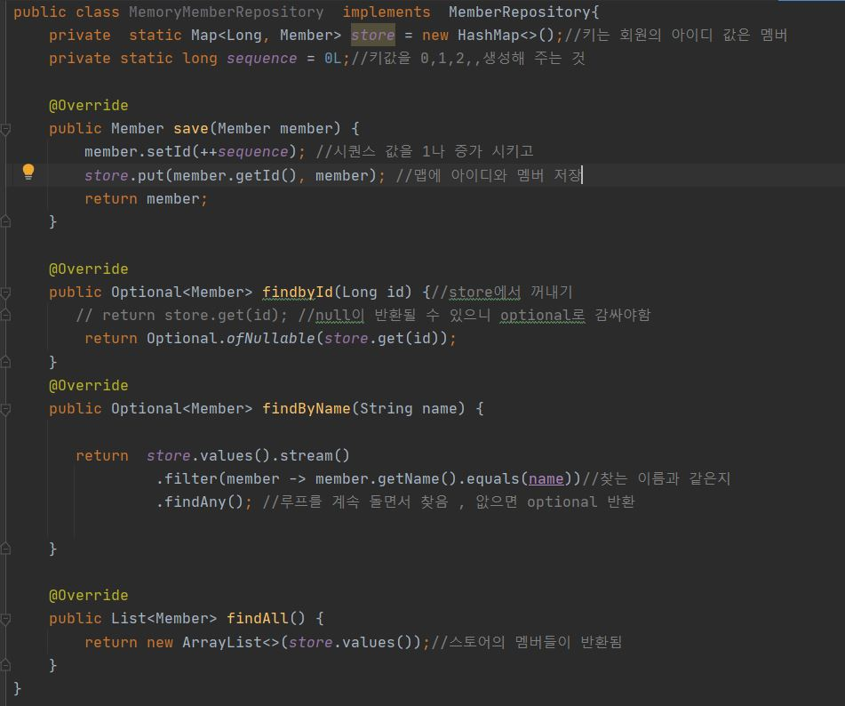
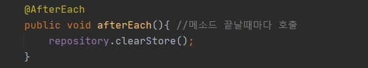

# 라이브러리
## gradle 누르면 dependencies

* Timeleaf가 사용하는 라이브러리 있고, 그 라이브러리가 쓰는 라이브러리가 연속으로 들어있음.
* springnoot-start web
 - spring bart web
 - spring boot0start -tomcat: 톰캣
 - spring-webmvc: 스프링 웹 MVC
  - 요즘엔 라이브러리 하나를  빌드해서 웹서버에 올리는 내장된 형태
* log로 개발 관리를 해야 심각한 오류 등을 알 수 있기에 system.out.print로 사용하면 안된다.
* springboot에 logging 관랸 라이브러리가 있다.
* 테스트는 junit 5버전 주로 사용. 
* assertj 등은 테스트를 하도록 도와주는 것
* spring/test는 스프링과 통합해서 테스트할 수 있도록 도와줌

# View 환경 설정

## Spring Boot<

* Springdot.io에 들어가서 spring Boot 눌러서 매뉴얼에서 검색
* 정적페이지는 그냥 올려 놓은 것

## Thymeleaf 

 * 템블렛 엔진으로 동적으로 동작

## 동적인 화면 만들기

* 스프링 동작 원리

  

  
* Controller
  - Hello spring 안에 패키지로 컨트롤러 추가
  - Mvc 패턴 사용하기 위해 model 추가
  - 컨트롤러의 리턴값이 일치하는 이름의  html로 넘어감(뷰 리졸버)
  - Resources:templates/ + 뷰이름 .html
  - 템플렛에서 data는 컨트롤러의 attributeValue값

# 스프링 웹개발 기초

## 정적컨텐츠

-	웹 브라우저에 그대로 올리기
## MVC패턴
  
- Html을 동적으로  변환하는 템플렛 엔진
-	컨트롤러, 템플렛 엔진, 모델 
-	서버에서 변형해서 hmtl을 내리는 방식
## API

-	json이라는 데이터 포멧 사용
-	화면은 클라이언트가 그림
-	서버끼리 통신할 때도 사용
## 정적 컨텐츠(과정)

-	컨트롤러가 확인하고 매핑되는 컨트롤러가 없으면
-	내부에 있는 source에서해ㅙ당 파일을 찾고 있으면 내보냄
## MVC 템플릿 엔진

-	과거에는 컨트롤러와 뷰가 분리되어있지 않았음(모델1)
-	지금은 분리. 뷰는 화면을 보여주는 부분, 컨트롤러와 모델은 비즈니스 로직, 서버와 관련모델은 관련 내용을 담음
-	Tymeleaf 장점: html을 그대로 쓰고 서버 없이 열어도 동작 가능
-	requestParam에 required는 default는 true로 url에 인자 필요(get)
-	스프핑 부트 내장에서 viewResolver가 뷰를 찾아주고 템플릿을 연결 시켜줌

## API 방식

- 
  **ResponseBody**
    - http의 바디부에 집적 넣어 주겠다는 의미
    - 	html은 무겁지만 json이 더 가볍다.
    -	스프링도 json을 반환하는 게 기본

- html 태그가 하나도 없음

- 자바에서 get, set은 자바빈 표준규약(property 접근방식)

 -	스프링에 Responsebody가 있으면 hrml에 그대로 넘겨주는데, 문자가 아니고 객체를 넘기게 되면 기본 디폴트가 제이슨 방식으로 데이터를 만들어서 반환하겠다.
  -	대표적 라이브러리: MappingJackson2

# 벡엔드 예제 - 회원 관리 

## 도메인 생성
- 아이디, 이름이 있어야함

## 리퍼지터리 생성
- 기능 생성
- 회원 객체를 저장하는 저장소
-  인터페이스 생성
   - Optional은 자바 8에서 제공하는 기능. NUL을 반환할 때 감싸서 반환

## 리퍼지터리 구현
- Class로 생성하여 인터페이스 implement

## 테스트 케이스 작성하기
-	코드를 코드로 검증.
-	자바의 메인 메서드를 통해서 실행하거나 웹 애플리케이션의 컨트롤러를 통해 해당 기능을 실행한다. 그러나 이는 반복 실행이 어렵고 여러 테스트 동시하기 어렵다
-	자바 Junit이라는 프레임워크를 사용하는 것이 좋음
    * Shift+F6으로 복사하고 rename가능
- test마다 실행 가능, 전체 테스트들을 포함하는 class를 실행하여 여러 테스트를 동시에 실행할 수도 있음

- 순서 의존적으로 테스트 작성하면 안됨
  *  테스트 끝나면 데이터들을 삭제해 주어야함

- 테스트 케이스를 만들고 개발하는 것을 테스트 주도 개발 (tdd)이라고도 함
-	위의 과정은 그 반대
-	그런데 테스트 케이스가 한두개가 아닌 경우 build 또는 gradelw 빌드하면 여러 개를 동시에 테스트 해줌

##	회원 서비스
- 회원 리퍼지터리를 활용하여 비즈니스 로직을 작성
- 관계자들도 보는 파트로 비즈니스적 용어를 사용하여 작성해야 함.
- reflactor에서 extract Method 하면 해당 코드를 따로 메소드로 생성가능

## 서비스 테스트
- 메소드에서 컨트롤 시프트 t+ 방향키 윗키
- 같은 패키지에 자동으로 생성 됨
- 메소드 이름 한글로 해도 됨
- Alt + endter로 스태틱 메소드로 만들 수 있음
- Shift f10하면 이전에 실행한 것 다시 실행
- 서비스에서 멤버 리퍼지터리를 넣어주지않고 외부에서 넣어주도록 함(Defendency rejection)
- given, when, then 순으로 테스트 생각하기

  

